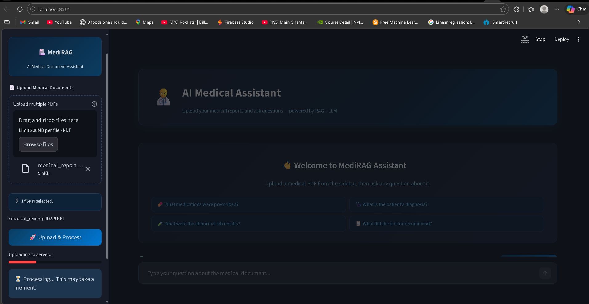
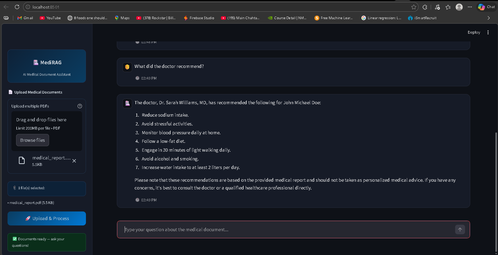

# 🏥 MediRAG Assistant
### End-to-End Modular RAG Medical AI Assistant

[](https://python.org)
[](https://fastapi.tiangolo.com)
[](https://streamlit.io)
[](https://pinecone.io)
[](https://langchain.com)
[](LICENSE)

---

> **MediRAG Assistant** is an AI-powered medical document assistant that allows users to upload medical PDF reports and ask natural language questions about them. Built using Retrieval-Augmented Generation (RAG) with LangChain, Pinecone, FastAPI, and HuggingFace LLMs.

---

## 📸 Demo

> 💡 *Screenshots coming soon — run locally to see the full UI*

| Upload Documents | Ask Questions |
|---|---|
|  |  |

---

## ✨ Features

- 📄 **Upload multiple medical PDFs** and process them into a vector store
- 🤖 **Ask natural language questions** about your medical documents
- 🧠 **RAG pipeline** — retrieves relevant context before generating answers
- 💬 **Chat history** with timestamps
- 💾 **Download chat history** in TXT, JSON, or Markdown format
- 🎨 **Modern dark UI** built with Streamlit
- ⚡ **Fast REST API** backend built with FastAPI
- 🔒 **Secure** — API keys stored in `.env`, never hardcoded

---

## 🏗️ Project Architecture

```
┌─────────────────────────────────────────────────────────────┐
│                        USER BROWSER                         │
│                    (Streamlit Frontend)                      │
│              localhost:8501                                  │
└────────────────────────┬────────────────────────────────────┘
                         │ HTTP Requests
                         ▼
┌─────────────────────────────────────────────────────────────┐
│                    FASTAPI BACKEND                           │
│                   localhost:8000                             │
│                                                              │
│   POST /upload_pdfs/          POST /ask/                    │
│   ┌──────────────┐           ┌──────────────┐              │
│   │ PDF Loader   │           │  Embedder    │              │
│   │ PyPDF        │           │  BGE-small   │              │
│   │ Chunker      │           │              │              │
│   │ Embedder     │           │  Retriever   │              │
│   └──────┬───────┘           └──────┬───────┘              │
└──────────┼────────────────────────  ┼ ──────────────────────┘
           │  Upsert vectors          │  Query vectors
           ▼                          ▼
┌─────────────────────────────────────────────────────────────┐
│                    PINECONE VECTOR DB                        │
│              Index: meddiassist (cosine, dim=384)            │
└─────────────────────────────────────────────────────────────┘
                                      │
                          Top-K chunks retrieved
                                      │
                                      ▼
┌─────────────────────────────────────────────────────────────┐
│                  HUGGINGFACE LLM                             │
│          meta-llama/Llama-3.1-8B-Instruct                   │
│                                                              │
│   Context + Question → RAG Chain → Final Answer             │
└─────────────────────────────────────────────────────────────┘
```

---

## 🗂️ Project Structure

```
MediRAG-Assistant/
│
├── server/                         # FastAPI Backend
│   ├── main.py                     # App entry point
│   ├── logger.py                   # Custom logger
│   ├── middleware/
│   │   └── exception_handlers.py  # Global error handler
│   ├── routes/
│   │   ├── upload_pdf.py          # POST /upload_pdfs/
│   │   └── ask_qus.py             # POST /ask/
│   └── module/
│       ├── llm.py                 # LLM + RAG chain setup
│       ├── load_vectorstores.py   # PDF → chunks → Pinecone
│       ├── pdf_handler.py         # File save utility
│       └── quer_handler.py        # Query execution
│
├── client/                         # Streamlit Frontend
│   ├── app.py                      # Main entry point
│   ├── config.py                   # API base URL config
│   ├── components/
│   │   ├── chatUI.py              # Chat interface
│   │   ├── upload.py              # PDF upload component
│   │   └── history_downloader.py # Download chat history
│   └── utils/
│       └── api.py                 # API call helpers
│
├── assets/                         # Screenshots & demo images
├── .env                            # API keys (never commit!)
├── .env.example                    # Template for env variables
├── .gitignore
├── requirements.txt
└── README.md
```

---

## 🛠️ Tech Stack

| Layer | Technology | Purpose |
|---|---|---|
| **Frontend** | Streamlit | Chat UI, file upload, history download |
| **Backend** | FastAPI | REST API, routing, middleware |
| **Vector DB** | Pinecone | Store and retrieve document embeddings |
| **Embeddings** | HuggingFace BGE-small-en | Convert text chunks to vectors (dim=384) |
| **LLM** | Llama 3.1 8B Instruct | Generate answers from retrieved context |
| **RAG Framework** | LangChain | Orchestrate retrieval + generation pipeline |
| **PDF Processing** | PyPDF | Extract text from uploaded PDF files |
| **Environment** | Python-dotenv | Manage API keys securely |
| **Logging** | Python logging | Track requests and errors |

---

## ⚙️ Installation & Setup

### Prerequisites
- Python 3.10+
- [HuggingFace Account](https://huggingface.co) + API Key
- [Pinecone Account](https://pinecone.io) + API Key

---

### Step 1 — Clone the Repository
```bash
git clone https://github.com/KunjanMinama/MediRAG-Assistant.git
cd MediRAG-Assistant
```

### Step 2 — Create Virtual Environment
```bash
python -m venv venv

# Windows
venv\Scripts\activate

# Mac/Linux
source venv/bin/activate
```

### Step 3 — Install Dependencies

**Backend:**
```bash
cd server
pip install -r requirements.txt
```

**Frontend:**
```bash
cd client
pip install -r requirements.txt
```

### Step 4 — Configure Environment Variables

Create a `.env` file inside the `server/` folder:
```bash
cp .env.example .env
```

Fill in your keys:
```env
HUGGINGFACE_API_KEY=hf_xxxxxxxxxxxxxxxxxxxxxxxx
PINECONE_API_KEY=xxxxxxxx-xxxx-xxxx-xxxx-xxxxxxxxxxxx
```

### Step 5 — Run the Backend
```bash
cd server
python -m uvicorn main:app --reload
```
Backend runs at → `http://127.0.0.1:8000`

### Step 6 — Run the Frontend
Open a **second terminal**:
```bash
cd client
python -m streamlit run app.py
```
Frontend runs at → `http://localhost:8501`

---

## 📡 API Documentation

Full interactive docs available at: `http://127.0.0.1:8000/docs`

---

### `POST /upload_pdfs/`
Upload one or more PDF files to be processed and stored in Pinecone.

**Request:**
```
Content-Type: multipart/form-data
Body: files[] = <PDF files>
```

**Response (200 OK):**
```json
{
  "message": "Files processed and vectorstore updated"
}
```

**Response (500 Error):**
```json
{
  "error": "Error description here"
}
```

---

### `POST /ask/`
Ask a natural language question about the uploaded documents.

**Request:**
```
Content-Type: application/x-www-form-urlencoded
Body: question=What is the patient diagnosis?
```

**Response (200 OK):**
```json
{
  "response": "Based on the provided documents, the patient's primary diagnosis is Hypertension (Stage 2)..."
}
```

**Response (500 Error):**
```json
{
  "error": "Error description here"
}
```

---

## 🔐 Environment Variables

Create a `.env` file in `server/` with the following:

| Variable | Description | Where to get |
|---|---|---|
| `HUGGINGFACE_API_KEY` | HuggingFace API token | [huggingface.co/settings/tokens](https://huggingface.co/settings/tokens) |
| `PINECONE_API_KEY` | Pinecone API key | [app.pinecone.io](https://app.pinecone.io) |

> ⚠️ **Never commit your `.env` file to GitHub!**

---

## 🚀 How It Works

```
1. User uploads a medical PDF
        ↓
2. PDF is parsed page by page using PyPDF
        ↓
3. Text is split into chunks (1000 chars, 200 overlap)
        ↓
4. Each chunk is embedded using BAAI/bge-small-en (384 dims)
        ↓
5. Embeddings are upserted into Pinecone with metadata
        ↓
6. User asks a question
        ↓
7. Question is embedded using the same model
        ↓
8. Top-8 similar chunks are retrieved from Pinecone
        ↓
9. Chunks + question are passed to Llama 3.1 8B via HuggingFace
        ↓
10. LLM generates a grounded, accurate answer
        ↓
11. Answer is displayed in the Streamlit chat UI
```

---

## 🤝 Contributing

Contributions are welcome! Here's how:

1. Fork the repository
2. Create a new branch: `git checkout -b feature/your-feature`
3. Make your changes and commit: `git commit -m "Add your feature"`
4. Push to your branch: `git push origin feature/your-feature`
5. Open a Pull Request

---

## 📋 Future Improvements

- [ ] User authentication and multi-user support
- [ ] Chat memory across sessions
- [ ] Support for multiple document formats (DOCX, TXT)
- [ ] Deploy to cloud (Render + Streamlit Cloud)
- [ ] Add document management (view/delete uploaded docs)
- [ ] Response streaming for faster UX

---

## 👨‍💻 Author

**Kunjan Minama**

[](https://github.com/KunjanMinama)

---

## 📄 License

This project is licensed under the **MIT License** — see the [LICENSE](LICENSE) file for details.

---

<div="center">
  <p>⭐ Star this repo if you found it helpful!</p>
  <p>Built with ❤️ using LangChain, Pinecone, FastAPI & Streamlit</p>
</div>
